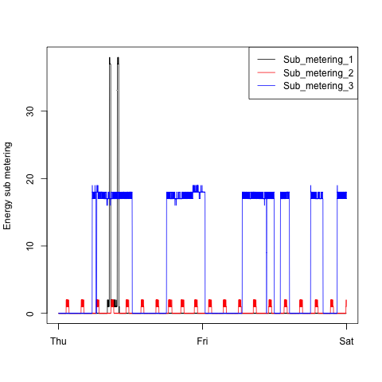
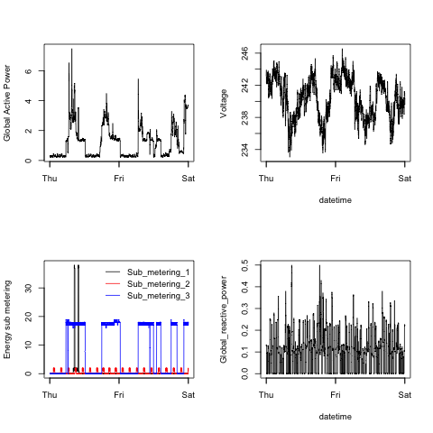

## Exploratory Data Science

<ul>
<li><b>Coursera Course: </b>exdata-012</li>
<li><b>Project 1</b></li>
<li><b>Project Due: </b>Sunday March 8, 2015</li>
<li><b>Student: </b>Jose Buraschi</li>
</ul>

This assignment uses data from
the <a href="http://archive.ics.uci.edu/ml/">UC Irvine Machine
Learning Repository</a>, a popular repository for machine learning
datasets. In particular, we will be using the "Individual household
electric power consumption Data Set" which I have made available on
the course web site:


## Reproducing the Student R Generated Plots

The following packages will require installation to run the student
scripts and generate the assignment plots.  Please install these 
packages in your R environment before running the student R code.

<ul>
<li><b>sqldf</b></li>
<li><b>gsubfn</b></li>
<li><b>proto</b></li>
<li><b>RSQLite</b></li>
<li><b>DBI</b></li>
</ul>


### Setting the Working Directory

The working directory can be set by uncommenting and correctly setting
the parameter in quotes for the setwd() function call on line 10 of each 
script.

setwd("/Users")


As can be seen on the listing of github files, there are 4 R scripts
that are used to generate the 4 assignment plots from the given dataset.

<ul>
<li><a href="https://github.com/joseburaschi/ExData_Plotting1/plot1.R">plot1.R</a></li>
<li><a href="https://github.com/joseburaschi/ExData_Plotting1/plot2.R">plot2.R</a></li>
<li><a href="https://github.com/joseburaschi/ExData_Plotting1/plot3.R">plot3.R</a></li>
<li><a href="https://github.com/joseburaschi/ExData_Plotting1/plot4.R">plot4.R</a></li>
</ul>


## Warning Messages to Ignore

Note the following warning message that can be ignored and that
have no effect on generating the plots.

```
Warning messages:
1: closing unused connection 4 ()
2: closing unused connection 5 ()
...
```

## Loading the data

The plot R scripts will require a connection to the internet to begin
the automatic download of the program dataset.  

* <b>Dataset</b>: <a href="https://d396qusza40orc.cloudfront.net/exdata%2Fdata%2Fhousehold_power_consumption.zip">Electric power consumption</a> [20Mb]

Information about the dataset can be found at <a href="https://archive.ics.uci.edu/ml/datasets/Individual+household+electric+power+consumption">UCI web site</a>:

Note that the dataset has 2,075,259 rows and 9 columns. The plots
only include data for February 1st and February 2nd 2007 as 
required by the assignment.


## Student R Generated Plots

Immediately below are the plots generated by this student's R programs.
Based on the assignment requirements the plot PNGs have been generated
to be 480 by 480 in size.


### Plot 1 - Student Plot

 


### Plot 2 - Student Plot

 


### Plot 3 - Student Plot

 


### Plot 4 - Student Plot

 


The four plots below were provided for the assignment and are of different 
dimensions to those required by the assignment.  The plots below are 
504 by 504 where the assignment requirements were to build plots that 
are 480 by 480.


### Plot 1 - Assignment Requirement


 


### Plot 2 - Assignment Requirement

 


### Plot 3 - Assignment Requirement

 


### Plot 4 - Assignment Requirement

 

